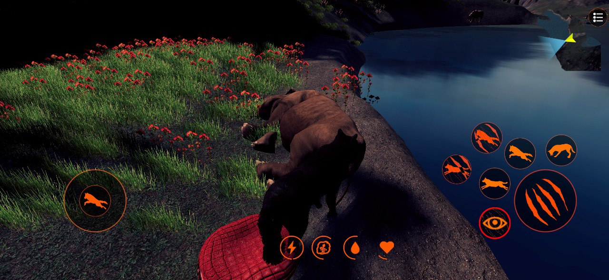
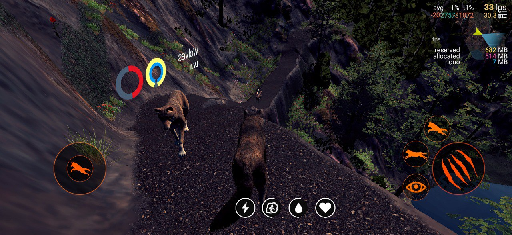
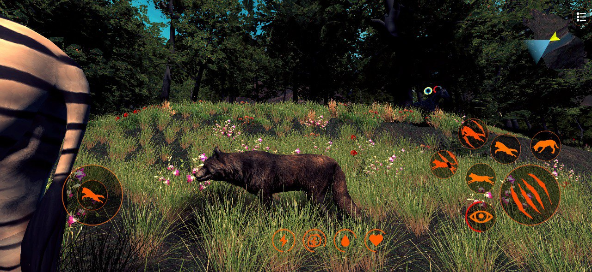
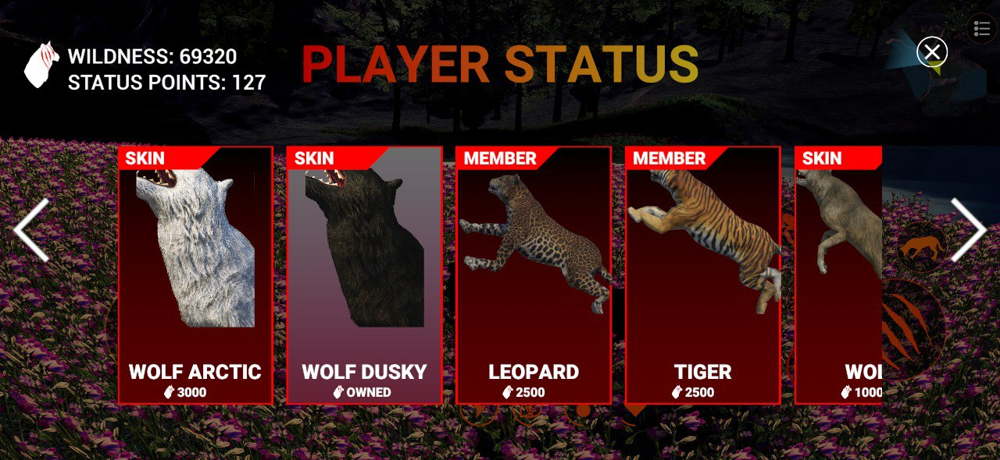
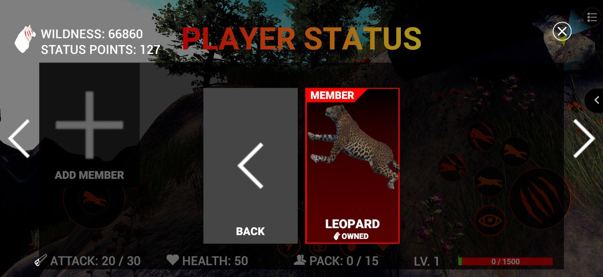
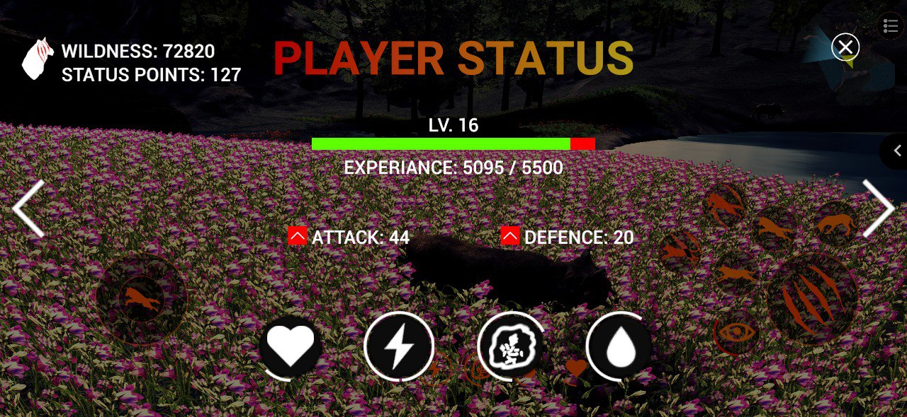
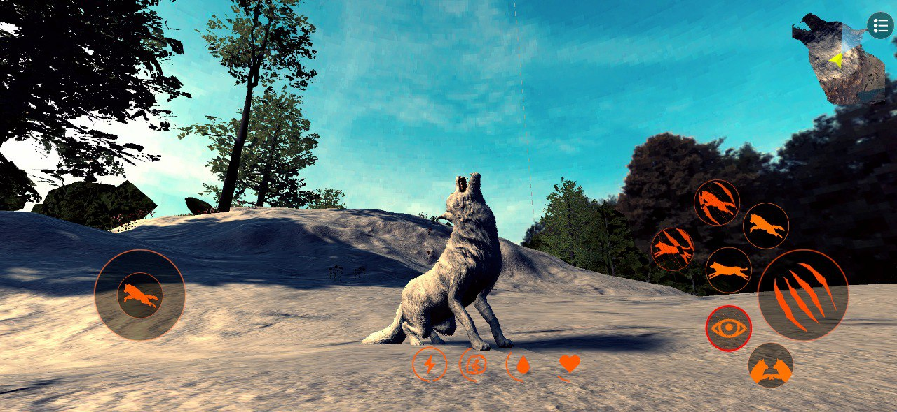
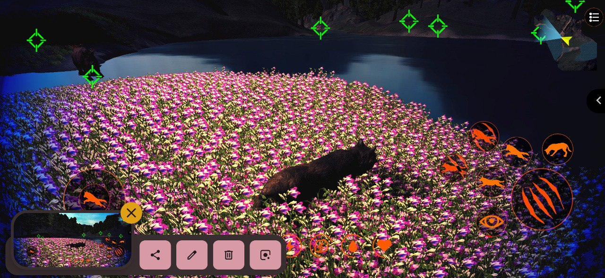

<h1 align="center">THE WILD ANIMAL</h1>
 
## A RPG & Animal Simulation Game & Complete Wildlife and Forest ECO system

## Player Mechanics 

- ### Movement
	- Idle
	- Walk
	- Run
	- Jump
	- Satisfy
	- Death
	- Slide
	- Air Movement
- ### Status
	- Level
	- Attack & Additional Attack Damage 
	- Defense & Additional  Defense
	- Experience - For Leveling Up
	- Wildness - The Game Currency
	- Special Ability
		- a special ability for sensing the nearby targets
- ### Pack
	- Player Can Have his Own Pack of Animals
	- Player isn't Restricted with Specific Animal Type
	- Player Can Buy Animals for Wildness
	- Animals can be Summoned for Status Points or Health Points
	- Pack Animals can be set as Followers or Free
- ### Taming
	- Other Animals are Tamable, Wild or Friendly
	- Player Can Tame Only Animals with Levels lower than Him
	- Taming Might not success, Developer can set the Succession Rate
- ### Combat
	- Attacks are Customizable  on many Aspects
	- Movements Per Attack
		- Face Target
		- Move Forward
		- Keep In Place
		- Move Freely
	-  Conditional Attacks - Player Condition to launch the Attack
		- None
		- Jumping
		- Running
		- Idle
	- Animation & Script Based Attack
	- Aim Assist
- ### Skins

## AI Mechanics 

- ### Multiply Behaviour
	- Aggressive - wild animals which is attacking any hostile animal or from another animal and type.
	- Pet - almost vegetarian animals which are living peacefully and running away if they find any wild animals in their field of view.
	- Passive - like pet type but stop escaping and attacking if the hostile target was in their attack range
	- Follower - follow a specific target like Pack leader to protect or attack his attackers and help him hunt
- Movement Types
	- Free
	- Stationary
	- Waypoints
All AI Animals are customizable in terms of behaviour, abilities and attacks

## Survival Elements For Both of Player & AI

- Health
	- Support for Fall Damage
- Hunger
- Thirst
- Stamina

## Type Based Needs Satisfaction 

AI Survival urges satisfaction is based on AI type as the AI satisfy their thirst for Water by seeking for lakes and rivers, however  for the hunger
- Aggressive AI attack and Hunt animals to satisfy it's Hunger 
- The other types will seek for scripted Satisfy Areas like trees or plants 

## Pack System

Animals have Packs System that every group have it's unique behaviour
- Wild or Friendly
- Members Count Range
- Leader's and Follower Behaviour
- Custom Levels Per Pack Animals
- Exp and Wildness on Kill

The player also supports the Pack System so he can get pack members using State Points or Health Points and he can get more than just wolves in his pack based on the developer configuration

## Shop

Player can Buy Different goods from Shop
- Skins - Custom Skins for Player Character
- Members - Custom Animals to be Member of Player's Pack
- Vitals - Consumable Items that affects Player Life Behaviour

### Project is PC & Mobile Ready and Optimized
### Project almost customizable on all aspects

## Screenshots
All Screenshots from my Unreleased Mobile Game "The Wolf of Wild Stream" that based on this project
I Removed all assets due the Copyrights and replaced it with free CC0 assets

